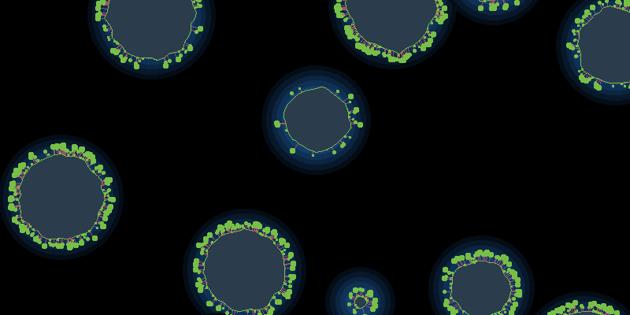

## py-2050 SK
Generovanie takýchto obrázkov vesmíru podľa zadaných parametrov. Objekty na obrázku sú generovane postupne pridávaním vrstiev. Jednotlivé vrstvy sú na sebe závislé. Pri tomto programe som si chcel vyskúšať generovanie nekonečného priestoru týmto spôsobom.

Obrázky môžu byť uložené v aktuálnom priečinku alebo len zobrazené.

### Použitie
```python 2050.py -h```

```python 2050.py -W 800 -H 400 -s 96 -z 80```

## py-2050 EN
Generating images of space based on given parameters. All objects in image are generated using layers. Layers are applied in given order, and each layer depends on layer before.

Images can be saved in current directory or displayed.

### Usage
```python 2050.py -h```

```python 2050.py -W 800 -H 400 -s 96 -z 80```